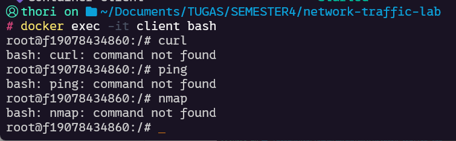

# Hands-On Lab Session: Virtual Lab Setup and Basic Traffic Analysis

## Introduction

### Objectives

- Set up virtual lab environment with Docker
- Capture traffic between client and web_server
- analyze the traffic in wireshark

### Overview

In this practice, we will set up a virtual lab environment using Docker. Two containers will be created: the first one as a client and the second one as a web server. After running the Docker containers, we will capture the network traffic between the client and the web server during their communication. Finally, we will analyze the captured traffic using Wireshark.

## Methodology

### Set Up Virtual Lab Environment with Docker Compose

The first requirement is Docker, so ensure that Docker is installed on the system.  
Next, save the following code as a `docker-compose.yml` file:

```yaml
version: "3.8"
services:
  web_server:
    image: nginx:latest
    container_name: web_server
    networks:
      - my_network
  client:
    image: ubuntu:latest
    container_name: client
    tty: true # Keeps the container running interactively
    networks:
      - my_network
    command: bash # Starts an interactive shell

networks:
  my_network:
    driver: bridge
```

To launch the environment, execute the following command:
`docker-compose up -d`

## Discussion

So when doing this practice, i've encountered some problem,

- no curl, and nmap installed on client machine
  
- windows cant capture traffic that established between the containers

to solve the first problem, i create a new docker file for the client, so we dont have to install the tools whenever we rerun the docker compose. here's the Dockerfile and the modified line on docker-compose.yaml

- client.Dockerfile

```dockerfile
FROM ubuntu:latest

RUN apt update && apt install nmap curl iputils-ping -y

```

- docker-compose.yml

```yml
version: "3.8"
services:
  web_server:
    image: nginx:latest
    container_name: web_server
    networks:
      - my_network
  client:
    build:
      context: client
      dockerfile: client.Dockerfile
    container_name: client
    tty: true
    networks:
      - my_network
    command: bash
networks:
  my_network:
    driver: bridge
```

then for the second problem, i solve it by use the web_server container to capture the traffic then save it to a directory that binded to windows directory, also i create a new Dockerfile and modify the Docker Compose file to solve this problem.

- web.Dockerfile

```dockerfile
FROM nginx:latest

RUN apt update && apt install tcpdump -y
```

- docker-compose.yml

```yml
version: "3.8"
services:
  web_server:
    build:
      context: web_server
      dockerfile: web.Dockerfile
    container_name: web_server
    volumes:
      - ./result:/output:rw
    networks:
      - my_network
  client:
    build:
      context: client
      dockerfile: client.Dockerfile
    container_name: client
    tty: true
    networks:
      - my_network
    command: bash
networks:
  my_network:
    driver: bridge
```

## Results and Analysis

_(Present the findings from the lab session. Use bullet points, tables, or code snippets if necessary.)_

## Conclusion

_(Summarize key takeaways, learning points, and any recommendations for future improvements.)_
